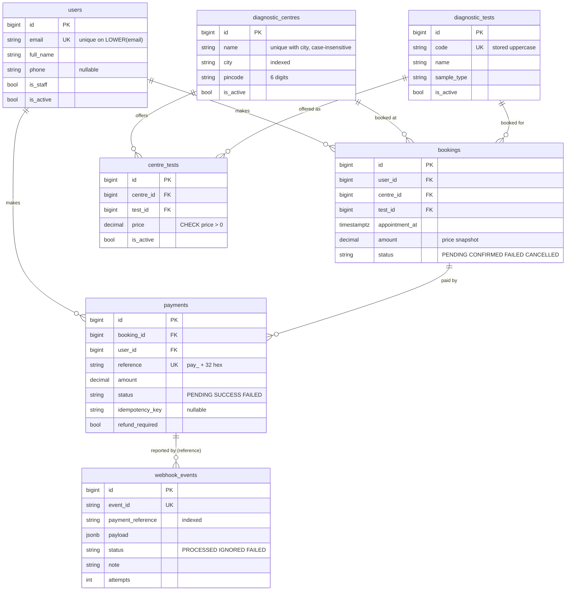
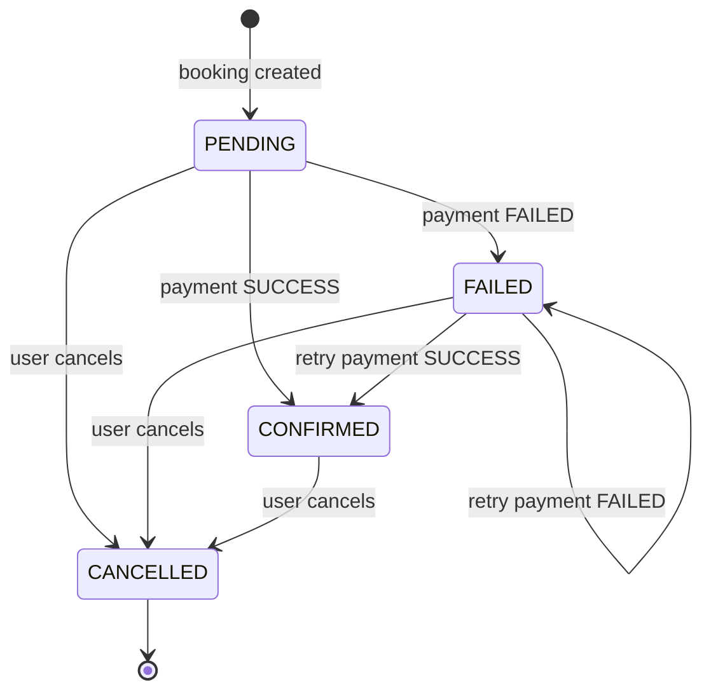

# EVE Diagnostics — Test Booking & Payments API

[](https://github.com/sagarjain03/eve-healthcare/actions/workflows/ci.yml)

Repository: https://github.com/sagarjain03/eve-healthcare

A backend-only REST API for booking diagnostic tests. Users sign up, browse diagnostic centres and the tests they offer (with per-centre prices), book a test for a date/time, and pay through a **simulated** payment service. A mock payment provider reports results through an **idempotent, HMAC-signed webhook**. Built with Django + Django REST Framework on PostgreSQL.

## Highlights

- **Idempotent, signed webhook** — HMAC-SHA256 over the raw body; each `event_id` is applied at most once, even when sent concurrently; failures are stored and retried.
- **One state machine** — booking status changes only in `apps/bookings/state_machine.py`; payment results reach bookings only through `apply_payment_result()`.
- **Integrity in the database** — unique, partial-unique and check constraints (one active booking per slot, one in-flight/successful payment per booking, prices > 0, case-insensitive email).
- **Safe under concurrency** — `select_for_update` row locks with a fixed lock order (booking → payment); verified with multi-threaded tests.
- **One error format everywhere** — `{"error": {"code", "message", "details"}}` for every non-2xx response, including 404/500 from Django itself.
- **223 tests, 98% coverage** — every edge case from the spec is mapped to its tests in [docs/EdgeCases.md](docs/EdgeCases.md).
- **Docker + CI** — `docker compose up --build` runs migrations, seeds data and starts gunicorn; GitHub Actions runs lint, format, migration and test checks.

## Tech stack

| Area | Choice |
|---|---|
| Language / framework | Python 3.12, Django 5.2, Django REST Framework |
| Database | PostgreSQL 16 (`psycopg` 3) |
| Auth | JWT (`djangorestframework-simplejwt`) |
| API docs | OpenAPI 3 + Swagger UI (`drf-spectacular`) |
| Filtering | `django-filter` |
| Config | `django-environ` (`.env`) |
| Tests / quality | `pytest`, `pytest-django`, `factory-boy`, `pytest-cov`, `ruff` |
| Packaging | `uv` (`pyproject.toml` + `uv.lock`) |
| Runtime | Docker, gunicorn, whitenoise (static files) |

## Quick start (Docker)

Requirements: Docker (with Compose) and Python 3 (only to generate a secret and run the demo webhook script).

```bash
# 0. Get the code
git clone https://github.com/sagarjain03/eve-healthcare.git
cd eve-healthcare

# 1. Create your env file
cp .env.example .env            # Windows cmd: copy .env.example .env

# 2. Generate a webhook secret and paste it into .env as WEBHOOK_SECRET=<value>
python -c "import secrets; print(secrets.token_hex(32))"

# 3. Build and start Postgres + the API (migrates and seeds demo data on start)
docker compose up --build
```

Open **http://localhost:8000/api/docs/** (Swagger UI). Health check: http://localhost:8000/health/.

- Seeded admin (**dev only**): `admin@eve.local` / `Admin@12345` — use it at http://localhost:8000/admin/ or to call admin-only endpoints.
- Seed data: 8 tests, 4 centres (2 in Delhi, 1 Mumbai, 1 Bengaluru), 25 priced offerings.
- Postgres is published on host port **5433** (not 5432) so it doesn't clash with a locally installed Postgres.
- Stop with `docker compose down` (add `-v` to also delete the database volume).

## Run locally without Docker (uv)

```bash
uv sync                                   # install dependencies (incl. dev tools)
cp .env.example .env                      # then set WEBHOOK_SECRET as above
docker compose up -d db                   # Postgres only, on localhost:5433
uv run python manage.py migrate
uv run python manage.py seed_data         # idempotent: safe to run again
uv run python manage.py runserver         # http://localhost:8000/api/docs/
```

## Tests and quality checks

```bash
docker compose up -d db                              # tests need Postgres
uv run pytest                                        # 223 tests
uv run pytest --cov --cov-report=term-missing        # coverage (98%)
uv run ruff check .
uv run ruff format --check .
uv run python manage.py makemigrations --check --dry-run
```

Tests run against **PostgreSQL, not SQLite**, because the design relies on Postgres features: partial unique indexes, row locks (`select_for_update`) and expression indexes.

## API overview

Full request/response schemas: **http://localhost:8000/api/docs/**. Lists are paginated (`?page=`, `?page_size=` up to 100).

| Method | Path | Auth | Description |
|---|---|---|---|
| **Auth** | | | |
| POST | `/auth/signup/` | none | Register (email, password, full_name, phone?) |
| POST | `/auth/login/` | none | Email + password → `{access, refresh}` |
| POST | `/auth/token/refresh/` | none | Refresh → new access token |
| GET | `/auth/me/` | JWT | Current user |
| **Centres & tests** | | | |
| GET | `/centres/` | none | Active centres; filters `?city=`, `?test=<id or code>` |
| GET | `/centres/{id}/` | none | Centre + offered tests with prices |
| POST / PATCH | `/centres/`, `/centres/{id}/` | admin | Create / update / deactivate a centre |
| POST | `/centres/{id}/tests/` | admin | Add a test offering or update its price |
| GET | `/tests/`, `/tests/{id}/` | none | Test catalog; `?search=` on name/code |
| POST / PATCH | `/tests/`, `/tests/{id}/` | admin | Create / update / deactivate a test |
| **Bookings** | | | |
| POST | `/bookings/` | JWT | Create a booking (amount taken from the server price) |
| GET | `/bookings/` | JWT | My bookings; filter `?status=` |
| GET | `/bookings/{id}/` | JWT | My booking detail |
| POST | `/bookings/{id}/cancel/` | JWT | Cancel my booking |
| **Payments** | | | |
| POST | `/payments/` | JWT | Simulated payment; optional `Idempotency-Key` header |
| GET | `/payments/` | JWT | My payments; filter `?booking=` |
| GET | `/payments/{reference}/` | JWT | My payment detail |
| **Webhook** | | | |
| POST | `/payments/webhook/` | HMAC signature | Payment provider status update |
| **Ops** | | | |
| GET | `/health/` | none | Database ping |
| GET | `/api/schema/`, `/api/docs/` | none | OpenAPI schema, Swagger UI |

There is no `DELETE`: centres and tests are deactivated with `PATCH {"is_active": false}` so booking history stays intact.

## End-to-end example

Bash syntax (Linux/macOS, or Git Bash on Windows). Every step also works from Swagger's **Try it out**. Uses `python` only to read fields from JSON (use `python3` if that's your command). Assumes the Docker quick start is running with fresh seed data.

```bash
BASE=http://localhost:8000
JSON='Content-Type: application/json'
field() { python -c "import json,sys; print(json.load(sys.stdin)$1)"; }

# 1. Sign up (returns the user, no tokens)
curl -s -w '\n' -X POST $BASE/auth/signup/ -H "$JSON" \
  -d '{"email":"asha@example.com","password":"StrongPass!123","full_name":"Asha Rao"}'

# 2. Log in and keep the access token
TOKEN=$(curl -s -X POST $BASE/auth/login/ -H "$JSON" \
  -d '{"email":"asha@example.com","password":"StrongPass!123"}' | field "['access']")
AUTH="Authorization: Bearer $TOKEN"

# 3. Centres in Delhi that offer CBC; pick the first one and the CBC test id
curl -s -w '\n' "$BASE/centres/?city=delhi&test=cbc"
CENTRE_ID=$(curl -s "$BASE/centres/?city=delhi&test=cbc" | field "['results'][0]['id']")
TEST_ID=$(curl -s "$BASE/tests/?search=cbc" | field "['results'][0]['id']")

# 4. Book it 3 days from now (appointments must be in the future and within 90 days)
SLOT=$(python -c "import datetime as d; print((d.datetime.now(d.timezone.utc)+d.timedelta(days=3)).strftime('%Y-%m-%dT10:00:00Z'))")
RESP=$(curl -s -X POST $BASE/bookings/ -H "$AUTH" -H "$JSON" \
  -d "{\"centre_id\":$CENTRE_ID,\"test_id\":$TEST_ID,\"appointment_at\":\"$SLOT\"}")
echo "$RESP"; BOOKING_ID=$(echo "$RESP" | field "['id']")

# 5. Pay with outcome FAILED → payment FAILED, booking FAILED
curl -s -w '\n' -X POST $BASE/payments/ -H "$AUTH" -H "$JSON" \
  -d "{\"booking_id\":$BOOKING_ID,\"outcome\":\"FAILED\"}"

# 6. Retry with SUCCESS and an Idempotency-Key → 201, booking CONFIRMED.
#    Run the same command again → 200 with the SAME reference (no second charge).
curl -s -w '  [HTTP %{http_code}]\n' -X POST $BASE/payments/ -H "$AUTH" -H "$JSON" \
  -H "Idempotency-Key: order-$BOOKING_ID-retry" \
  -d "{\"booking_id\":$BOOKING_ID,\"outcome\":\"SUCCESS\"}"

# 7. Paying a CONFIRMED booking again (new request, no key) → 409 error
curl -s -w '\n' -X POST $BASE/payments/ -H "$AUTH" -H "$JSON" \
  -d "{\"booking_id\":$BOOKING_ID,\"outcome\":\"SUCCESS\"}"

# 8. Second booking (next day), paid with outcome PENDING → waits for the webhook
SLOT2=$(python -c "import datetime as d; print((d.datetime.now(d.timezone.utc)+d.timedelta(days=4)).strftime('%Y-%m-%dT10:00:00Z'))")
BOOKING2=$(curl -s -X POST $BASE/bookings/ -H "$AUTH" -H "$JSON" \
  -d "{\"centre_id\":$CENTRE_ID,\"test_id\":$TEST_ID,\"appointment_at\":\"$SLOT2\"}" | field "['id']")
RESP=$(curl -s -X POST $BASE/payments/ -H "$AUTH" -H "$JSON" \
  -d "{\"booking_id\":$BOOKING2,\"outcome\":\"PENDING\"}")
echo "$RESP"
REF=$(echo "$RESP" | field "['reference']"); AMOUNT=$(echo "$RESP" | field "['amount']")

# 9. The "provider" sends the SAME signed SUCCESS event 3 times (secret is read from .env)
python scripts/send_webhook.py --reference $REF --status SUCCESS --amount $AMOUNT --times 3

# 10. Booking 2 is now CONFIRMED
curl -s -w '\n' $BASE/bookings/$BOOKING2/ -H "$AUTH"
```

Sample responses (trimmed):

```jsonc
// 3. GET /centres/?city=delhi&test=cbc
{"count": 2, "next": null, "previous": null, "results": [
  {"id": 2, "name": "CarePlus Labs", "address": "45 Lajpat Nagar II", "city": "Delhi", "pincode": "110024", "is_active": true},
  {"id": 1, "name": "HealthFirst Diagnostics", "city": "Delhi", ...}]}

// 4. POST /bookings/  → 201 (amount comes from the centre's price, never from the client)
{"id": 1, "status": "PENDING", "amount": "299.00", "appointment_at": "2026-10-01T10:00:00Z",
 "centre": {"id": 2, "name": "CarePlus Labs", "city": "Delhi"},
 "test": {"id": 1, "code": "CBC", "name": "Complete Blood Count"}, ...}

// 6. POST /payments/ with Idempotency-Key → 201 first time, 200 on replay (same reference)
{"reference": "pay_0e57a4a032e545d0bed535445be5c63b", "booking_id": 1, "amount": "299.00",
 "status": "SUCCESS", "failure_reason": "", "refund_required": false, "booking_status": "CONFIRMED", ...}

// 7. Error example → 409
{"error": {"code": "BOOKING_NOT_PAYABLE", "message": "Booking is CONFIRMED and cannot be paid.",
           "details": {"booking_status": "CONFIRMED"}}}

// 9. scripts/send_webhook.py --times 3
  send 1/3: HTTP 200 {"event_id":"evt_…","result":"PROCESSED","note":""}
  send 2/3: HTTP 200 {"event_id":"evt_…","result":"DUPLICATE","note":""}
  send 3/3: HTTP 200 {"event_id":"evt_…","result":"DUPLICATE","note":""}
```

## Database design



Important constraints and why they exist:

| Constraint | Why |
|---|---|
| `centre_tests` unique (centre, test) | A centre has one price per test; updates go through an upsert. |
| `centre_tests.price > 0`, `bookings.amount > 0`, `payments.amount > 0` | Zero or negative money is always a bug; the DB refuses it. |
| `bookings.amount` is copied from the price | Price changes later must not change what the user agreed to pay. |
| `booking_active_unique`: unique (user, centre, test, appointment_at) **where status in (PENDING, CONFIRMED)** | No double booking, but re-booking a slot after cancelling/failing is allowed. |
| `payment_one_active_per_booking`: unique (booking) **where status in (PENDING, SUCCESS)** | At most one in-flight or successful payment per booking — no double charge — while failed retries are allowed. |
| `payment_idempotency_key_unique`: unique (user, idempotency_key) where key is not null | Retried client requests can't create a second payment; keys are per user. |
| `webhook_events.event_id` unique | The core webhook idempotency guard. |
| Unique on `LOWER(email)`, `LOWER(name) + LOWER(city)`; test codes uppercased | Duplicates that differ only by letter case are rejected, even by writes that bypass the ORM's `save()`. |
| `PROTECT` foreign keys from bookings/payments | Booking and payment history can't be deleted by removing a user, centre or test. |

## Booking state machine



| From | Allowed to |
|---|---|
| PENDING | CONFIRMED, FAILED, CANCELLED |
| FAILED | CONFIRMED, FAILED, CANCELLED |
| CONFIRMED | CANCELLED |
| CANCELLED | — (final) |

Status only changes in `apps/bookings/state_machine.py::transition()`; any other move raises `INVALID_STATE_TRANSITION` (409). Past appointments can't be cancelled.

## Payments and webhook

**`POST /payments/ {booking_id, outcome?}`** (own bookings only; PENDING or FAILED bookings with a future appointment):

| `outcome` | Payment | Booking |
|---|---|---|
| `SUCCESS` | SUCCESS | CONFIRMED |
| `FAILED` | FAILED (`failure_reason: SIMULATED_DECLINE`) | FAILED — user may retry |
| `PENDING` | PENDING | PENDING — settled later by the webhook (simulates an async provider) |
| omitted | random SUCCESS/FAILED using `PAYMENT_SUCCESS_RATE` (0.8) | as above |

`Idempotency-Key` header (optional, ≤ 100 chars, per user): the same key for the same booking returns the original payment with **200** instead of creating another; reusing it for a different booking is `409 IDEMPOTENCY_KEY_REUSED`.

**Webhook `POST /payments/webhook/`** — body `{event_id, payment_reference, status: SUCCESS|FAILED, amount}`, header `X-Webhook-Signature: sha256=<hex>` where hex is the HMAC-SHA256 of the **exact raw body** with `WEBHOOK_SECRET`:

```python
import hashlib, hmac, json

body = json.dumps(
    {"event_id": "evt_1", "payment_reference": "pay_…", "status": "SUCCESS", "amount": "299.00"}
).encode()
signature = "sha256=" + hmac.new(WEBHOOK_SECRET.encode(), body, hashlib.sha256).hexdigest()
# POST body as-is with header X-Webhook-Signature: <signature>
```

`scripts/send_webhook.py` does exactly this (`--times N` resends the same event, `--bad-signature` shows the 401).

| Result | When | Effect |
|---|---|---|
| `PROCESSED` | New event for a PENDING payment | Payment SUCCESS/FAILED, booking CONFIRMED/FAILED |
| `PROCESSED` + note `refund_required` | SUCCESS for a booking the user already cancelled | Payment SUCCESS with `refund_required=true`; booking stays CANCELLED |
| `IGNORED` + `already_in_status` | New event_id, payment already has that status | Nothing changes |
| `IGNORED` + `terminal_payment` | Conflicting late event (e.g. FAILED after SUCCESS) | Nothing changes; warning logged |
| `DUPLICATE` | Same `event_id` already processed/ignored | Nothing changes; `attempts` counted |
| `500 INTERNAL_ERROR` → FAILED | Unexpected error while processing | Rolled back; event stored as FAILED; retried on resend or by `manage.py reprocess_webhooks [--max-attempts 5] [--dry-run]` |
| 401 / 400 / 404 | Bad signature / bad payload or amount mismatch / unknown reference | Nothing stored, so the provider can fix and resend |

**Idempotency guarantee.** Each event is processed inside one database transaction that locks the booking row and then the payment row — the same order `POST /payments/` uses, so the two paths can't deadlock. The event row is inserted inside a savepoint; the unique `event_id` means a concurrent copy of the same event either waits for the lock and then sees it as `DUPLICATE`, or hits the unique violation and returns `DUPLICATE`. Because payments are final after SUCCESS/FAILED and the whole update is one transaction, a booking or payment can never change twice for one event — this is tested with 5 concurrent threads.

## Error handling

Every non-2xx response has the same shape:

```json
{"error": {"code": "BOOKING_NOT_FOUND", "message": "Booking not found.", "details": {}}}
```

| Status | Meaning | Example codes |
|---|---|---|
| 400 | Invalid input or business rule | `VALIDATION_ERROR` (field errors in `details`), `PARSE_ERROR`, `TEST_NOT_OFFERED`, `APPOINTMENT_IN_PAST`, `AMOUNT_MISMATCH` |
| 401 | Missing/invalid/expired token, bad webhook signature | `NOT_AUTHENTICATED`, `TOKEN_NOT_VALID`, `INVALID_SIGNATURE` |
| 403 | Authenticated but not allowed (non-admin writes) | `PERMISSION_DENIED` |
| 404 | Not found **or not yours** | `NOT_FOUND`, `BOOKING_NOT_FOUND`, `PAYMENT_NOT_FOUND` |
| 405 / 415 | Method / content type not supported | `METHOD_NOT_ALLOWED`, `UNSUPPORTED_MEDIA_TYPE` |
| 409 | Conflicts with current state | `DUPLICATE_BOOKING`, `INVALID_STATE_TRANSITION`, `BOOKING_NOT_PAYABLE`, `PAYMENT_IN_PROGRESS`, `EMAIL_ALREADY_EXISTS` |
| 429 | Rate limited (`details.wait` = seconds) | `THROTTLED` |
| 500 / 503 | Unexpected error (no internals exposed) / DB down | `INTERNAL_ERROR`, `DATABASE_UNAVAILABLE` |

Every edge case, where it is handled, and the tests that prove it: **[docs/EdgeCases.md](docs/EdgeCases.md)**.

## Project structure

```
config/                 Django project: settings/{base,local,test,prod}.py, urls.py (routes + JSON 404/500)
apps/
  common/               Shared: domain exceptions + DRF error handler, pagination, permissions,
                        JSON logging, request-id middleware, TimeStampedModel, /health/
  accounts/             Custom User (email login), signup/login/me, services.py
  centres/              Centres, tests, offerings (prices), filters, seed_data command
  bookings/             Booking model, state_machine.py, services.py (create/cancel)
  payments/             Payment + WebhookEvent, services.py (create_payment, apply_payment_result),
                        webhook.py (signature + processing), reprocess_webhooks command
  */tests/              Unit + API tests per app (factories.py, test_models/services/api.py)
tests/                  Cross-cutting tests (health, error shapes)
scripts/send_webhook.py Simulated payment provider (signs + sends events)
docker/entrypoint.sh    migrate → seed_data (optional) → gunicorn
docs/                   PRD, architecture, rules, phases, edge-case matrix, decision log
conftest.py             Shared pytest fixtures (api_client, user, auth_client, admin_client)
```

Layering: **views are thin** (validate input with a serializer → call a service → serialize the result). **Services** (`apps/*/services.py`, `state_machine.py`, `webhook.py`) hold all business rules, transactions and locks. **Models** hold data and database constraints. More detail: [docs/Architecture.md](docs/Architecture.md).

## Observability and security

- **Logs**: in Docker/prod, one JSON object per line (`timestamp`, `level`, `logger`, `message`, `request_id`, plus ids such as `booking_id`, `payment_reference`, `event_id`). Every response carries `X-Request-ID` (a valid incoming one is reused). Set `LOG_FORMAT=text|json`, `LOG_LEVEL`.
- **Rate limits**: signup/login 10/min per IP, `POST /payments/` 20/min per user. The webhook is not throttled.
- **Production settings** (`config/settings/prod.py`, used by the Docker image): `DEBUG=False`, `ALLOWED_HOSTS` required, whitenoise for static files. For a real HTTPS deployment set `SECURE_SSL_REDIRECT=true`, `SESSION_COOKIE_SECURE=true`, `CSRF_COOKIE_SECURE=true`, `SECURE_HSTS_SECONDS=31536000`, `SECURE_HSTS_INCLUDE_SUBDOMAINS=true`, `SECURE_HSTS_PRELOAD=true` — with these `manage.py check --deploy` reports no issues. They default to off so the container works over plain `http://localhost`.
- **Secrets**: `SECRET_KEY` and `WEBHOOK_SECRET` have no defaults — the app refuses to start without them. Secrets, passwords, tokens and signatures are never logged. Signatures are compared with `hmac.compare_digest`.
- **Data isolation**: every booking/payment query is filtered by the logged-in user. Another user's booking or payment returns **404, not 403**, so the API doesn't reveal that the id exists.

## Assumptions

1. Admin = a user with `is_staff=True` (created by `seed_data` or `createsuperuser`). Admins manage centres, tests and prices; everyone can read the active catalog without logging in.
2. Login is by email, case-insensitive. Signup returns the user without tokens; the client logs in next. A duplicate email is `409`.
3. A booking's `amount` is a snapshot of the centre's price at booking time. Client-sent `amount`/`status` fields are ignored.
4. Appointments must be in the future and at most 90 days ahead (`MAX_BOOKING_DAYS_AHEAD`). There is no slot capacity limit.
5. Datetimes are stored and returned in UTC (`…Z`). A datetime without an offset is treated as UTC; one with an offset (e.g. `+05:30`) is converted.
6. A CONFIRMED booking can be cancelled; refunds are out of scope (a payment that succeeds after cancellation is flagged `refund_required`).
7. Past appointments can't be cancelled or paid. A cancelled booking is final.
8. Re-booking the same slot is allowed once the earlier booking is CANCELLED or FAILED.
9. A payment is final once SUCCESS or FAILED; retrying creates a new payment. FAILED → FAILED on the booking is allowed so repeated declines don't error.
10. The `PENDING` payment outcome simulates an asynchronous provider whose result arrives by webhook.
11. Webhook requests rejected with 4xx are not stored, so the provider can correct and resend; only processed events are recorded.
12. Prices are returned as strings (`"499.00"`) to avoid floating-point rounding.
13. There is no DELETE for centres or tests; they are deactivated so booking history stays valid. Inactive centres/tests are hidden from non-admins.
14. Centre name + city and test codes are unique regardless of letter case; test codes are stored uppercase.
15. Postgres is published on host port 5433 to avoid clashing with a local Postgres on 5432.

The full decision log is in [docs/Memory.md](docs/Memory.md).

## Known limitations

- **Rate limits are per gunicorn worker**: throttling uses Django's in-memory cache, so with 3 workers a client can get up to ~3× the limit.
- **No real refunds**: `refund_required` payments are only flagged (and filterable in admin).
- **No slot capacity/availability**: any number of users can book the same centre and time.
- **No email verification or password reset**, and **no token revocation on logout** (access tokens expire after 30 minutes).
- **Webhook replay window**: the signature doesn't cover a timestamp, so a captured request could be replayed; replays are harmless (idempotent) but not rejected outright.
- **Failed webhooks are retried manually** (resend or `reprocess_webhooks`), not on a schedule.
- Swagger UI loads its JavaScript from a CDN.

## What I would improve with more time

- **Redis**: a shared cache for exact rate limits across workers, and caching of the public centre list with invalidation on admin writes.
- **Celery**: process webhooks asynchronously and retry FAILED events automatically with exponential backoff.
- **Refunds**: a refund flow for cancelled-but-paid bookings (driven by `refund_required`).
- **Slot capacity**: per-centre availability and capacity per time slot.
- **Webhook replay protection**: include a timestamp in the signed payload and reject old events.
- **Auth**: refresh-token blacklist/logout, email verification, password reset.
- **Admin audit log** for price and catalog changes.
- **Load testing** of booking and payment paths under concurrency.
- **API versioning** (`/api/v1/`).
